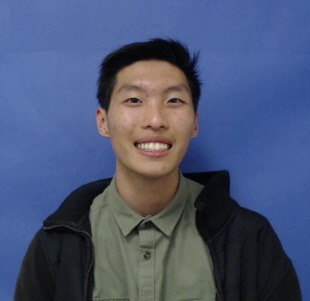

>"My name is Vincent Wu and I am a fourth year Math-Computer Science major at the University of California, San Diego with minors in Cognitive Science and History. As the technology in society is advancing, the need of automation becomes increasingly desired; this is quite evident in the power of mobile applications. To confront and contribute to this desire, I am pursuing an education and career that seeks to further my knowledge and allow me to invent modern solutions. Whatever tasks and problems that await us, I am determined to find an optimal solution." 

 
 

    Contact
     
    vincent.z.wu98.@gmail.com

