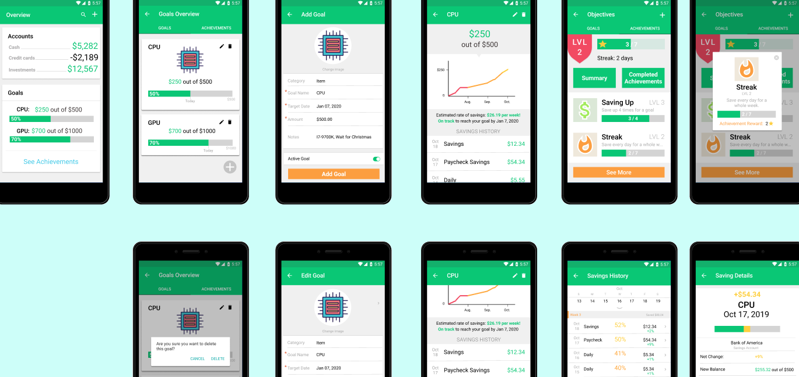
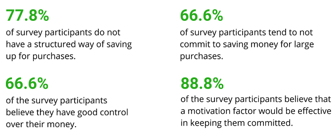
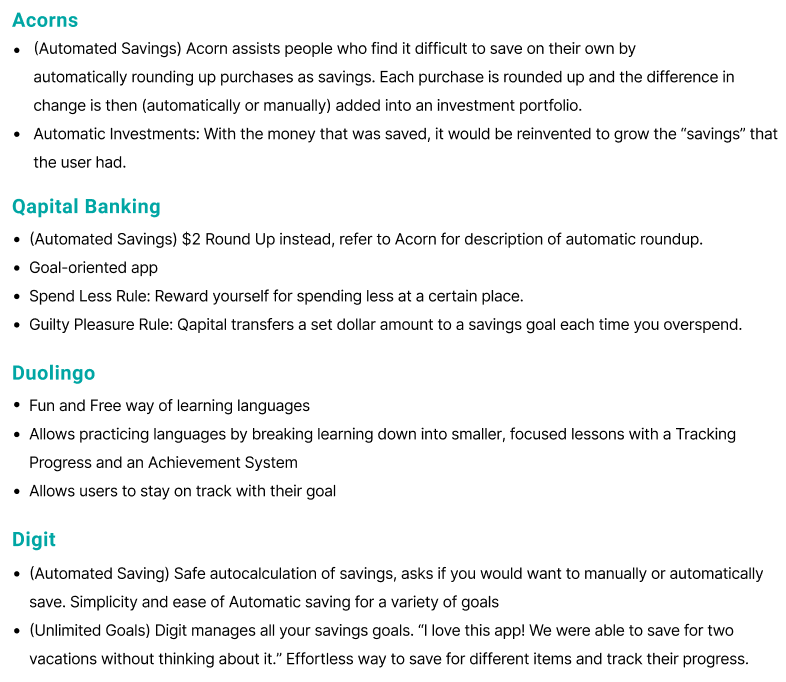
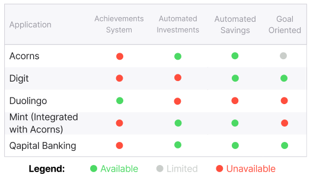
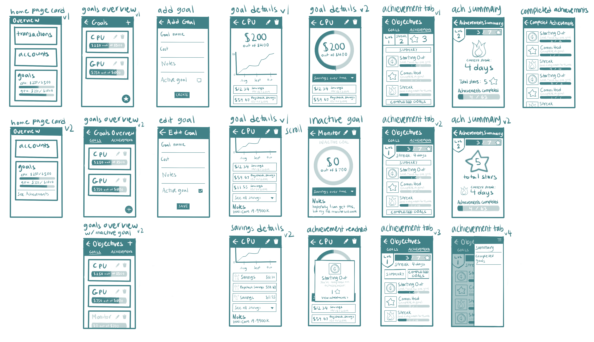

 

 <b><i>Mint: A Case Study</i></b>
  

 Design Project (Fall, 2019)  

 UC San Diego (COGS 127 – Data Driven UX/Product Design)

 

---

 

#  

---

#  <b>Project Overview</b>

>“As part of UC San Diego's "Designing Human-Data Interactions" course, I was tasked in a team of three to extend or redesign a feature that helps a specific type of user to save for a major upcoming high-cost purchase.
> Within the ten-week time frame of the course, our team learned about the UX/product design process that included prototyping and competitive audits."
 

## Our Objective

By extending the Mint app, our team hopes to further motivate young students to be more active in saving money.

## Our User

Our team has decided to use young students as our target user. We believe the younger generation of students are an ideal target user because students should learn at a younger age to start saving money whether it would be for big or small purchases; this would allow saving money to grow into a beneficial habit.

## User Goals

 By using our feature, our users should be able to:
* successfully save for a major purchase
* consistently stay motivated throughout their saving towards the purchase
* minimize other needless spending / expenditures
* fully enjoy their major purchase after saving up for it
 
 

---

#  <b>The Problem</b>

>"Young students especially those who are interested in personal finance need to be more motivated when using personal finance apps to promote a more active effort towards saving money."

At some point in their life, everyone experienced having a flow of income for
 their first time. For many, it can be overwhelming.  But as time goes on, we all realize that a little effort done periodically can go a long way. Setting money aside to gradually accumulate for certain purchases would ensure a more active/flexible way of saving money.
It can be extremely effective, fun, and simple. It’s easy to become demotivated from constantly checking bank applications or money management apps like Mint. Such applications are very general and stationary in financial planning, and do little besides just listing numbers. With a lighthearted money saving app focused on achievements and user satisfaction, the biggest issue in money management will be tackled: motivation. Therefore, our project aims to help youths learning to manage their money and to stay motivated consistently to save up for a high-cost purchase.

 

## Need Finding & User Research

Before we started to design our feature, we conducted a survey on the local 
student population through a Google Form that was sent out to popular UCSD 
Facebook pages. We figured a survey would preserve anonymity so people wouldn’t 
have to associate their financial habits with their identities. Our survey process also allowed us to gain an understanding of not just students, but also teens 
 and young adults with their first jobs. 
   
The major findings of our survey are summarized below: 
  

 

## Research Conclusions
 1.) Students have good control over their money, yet they often do not commit to saving periodically for large purchases

* Feeling overwhelmed by money
* Not being motivated enough
* Difficult to keep track of savings for specific purchases
* Not knowing if the end goal is ever going to happen

 2.) Students are discouraged when trying to save up. 

* Many banking or money management apps simply list numbers of how much the user has spent, so it is up to the user to constantly check back on the app to see their savings. 
* Many apps just flood the user with a lot of notifications which tire and eventually annoy the user.
* Throughout the process of saving, the user does not feel a sense of price or accomplishment at how much they have saved so far.

 3.) Students do not have a structured way of saving their money for specific purchases. 

* Most students “saved” up by simply keeping their goal in mind when spending.
* It is easy to lose track of how much the user has actually saved, versus what they recall and believe they saved.
 

---
#  <b>Design Process</b>
> "It's a process, not something dreamt overnight!"

## Competitive Analysis
The key principle of motivation in money management was inspired by the innovative features offered by Mint's competitors [Digit, Qapital Banking, and Acorns(formerly)] and by Mint's pre-existing integrations (Acorns). 
However, the most important feature for motivation that was absent in all of these apps was an achievement system which was mainly inspired by the language-learning app, Duolingo.

<!---        -->

Thus, to gauge how we should improve Mint, we performed a competitive audit and concluded that Mint (along with its integration with Acorns) needed to include an achievement system along with more user-defined goals.
   

 
 

## Prototyping 
 
<i>UX Flows</i>    
Before we design our feature onto Mint, we had to create UX flows that envisioned how our user was to navigate within the app to either create their goals or to manage their achievements.
   

<b>Flow 1: Managing User Goals</b> (Click to View)

   
<b>Flow 2: Managing User Achievements</b> (Click to View)

 
<i>UX Sketches</i>    
After the creation of UX flows, we created UI sketches to either conform to our UX flows or to change how our users were to interact with our features. 

 
<b>UI Sketches</b> (Click to View)

 

 
<i>Low Fidelity Paper Prototypes</i>    

